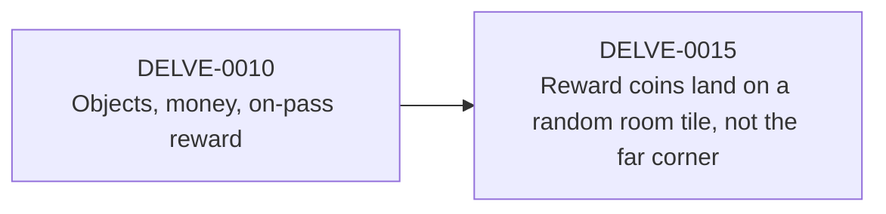
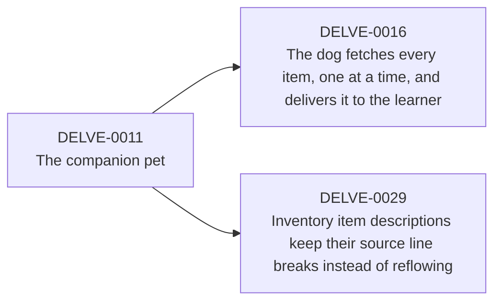
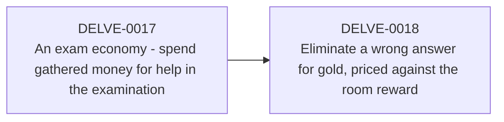
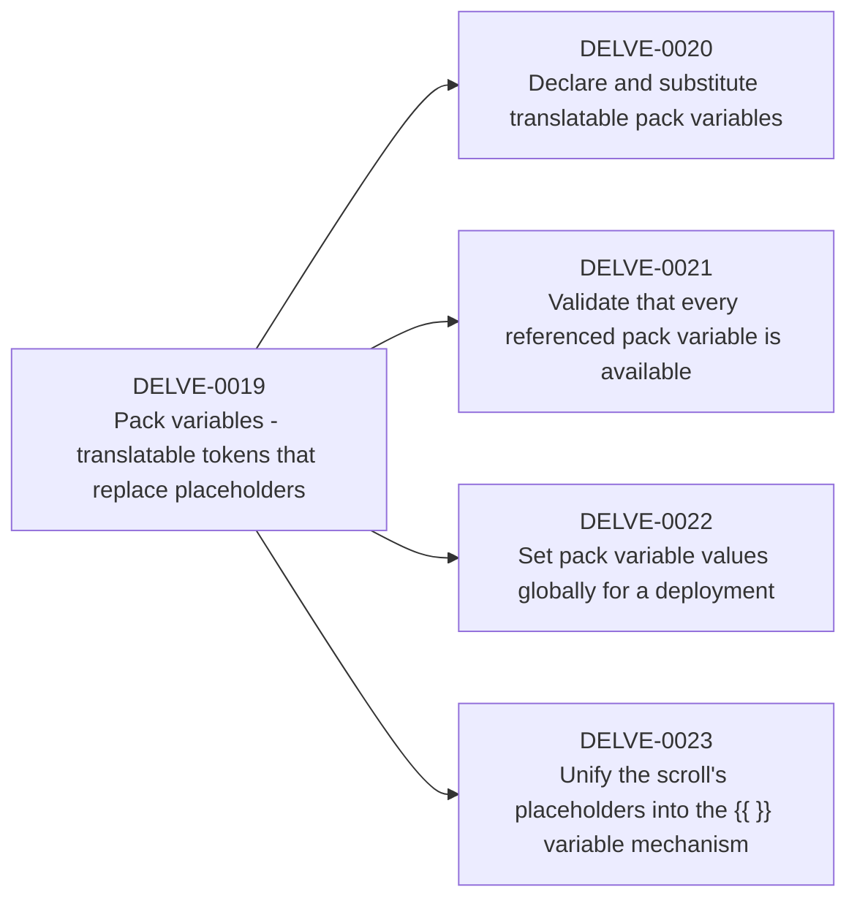
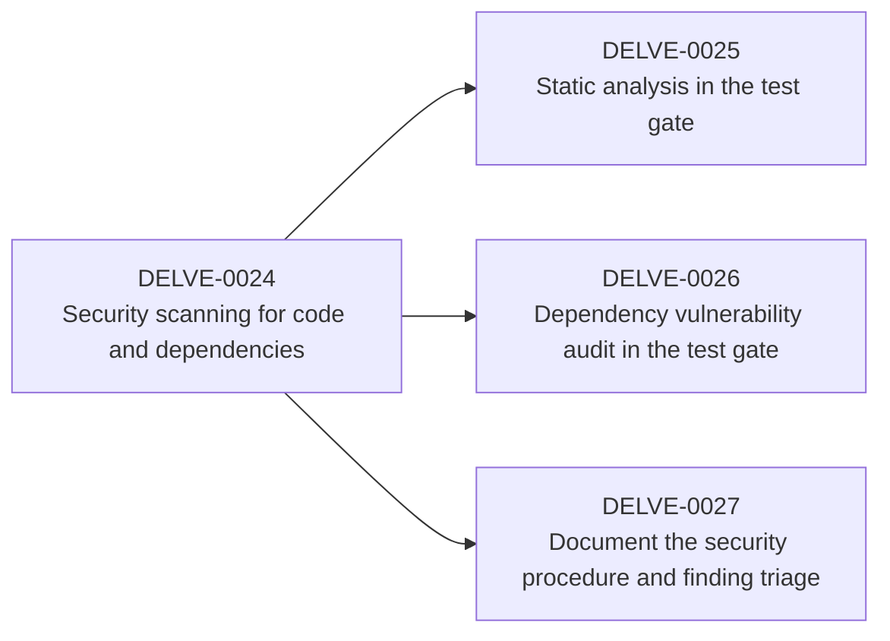
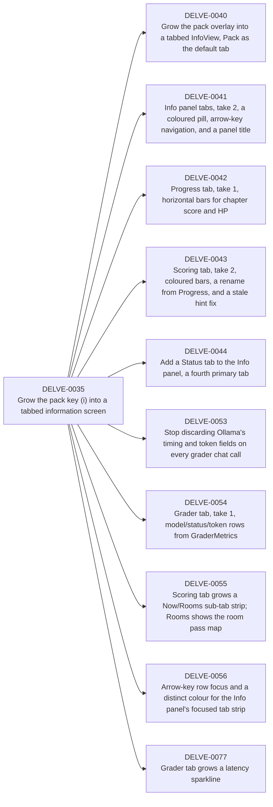

# Issues

Structured, human-readable issues for Delve. Each file states *what* a change should
do, in Markdown with a YAML front-matter block for metadata. This is deliberately separate
from the three places history already lives:

- `docs/` holds design essays: the *why* of a decision.
- `CHANGELOG.md` records *when* a feature shipped.
- git holds the diffs: the *how*.

An issue is the missing fourth thing: the *what*, written before (or, for the backfill,
recovered after) the code. Keep them short and testable; an issue that cannot be checked
is a wish.

## Layout

```
issues/
  README.md            this file: conventions + the index below
  TEMPLATE.md          copy this to author a new issue
  AGILE.md             the agile style: epics, features, user stories, DoR / DoD
  assets/              files (screenshots, etc.) attached to root issues
  archive/             implemented issues, each carrying its commit id(s)
  archive/assets/      files attached to archived issues
  rejected/            issues that were considered and turned down
  rejected/assets/     files attached to rejected issues
  (root)               active work: proposed / in-progress issues
```

An issue that needs a file attached (a screenshot clarifying a rendering bug, say) puts it in the
`assets/` directory beside it, named after the issue rather than given its own subdirectory:
`assets/DELVE-0034-torn-border.jpg`, referenced from the body as a relative Markdown link or
image (`assets/DELVE-0034-torn-border.jpg`). **Resize a screenshot to at most 800px wide and save
it as a JPEG, not a PNG, before adding it**:

```
sips --resampleWidth 800 file.png
sips -s format jpeg -s formatOptions 85 file.png --out file.jpg
```

A Markdown viewer reads it at panel width, not native screen resolution, so native-resolution
screenshots bloat the repo for no reason; PNG makes it worse, since `sips` has no PNG quality dial
and can re-encode a photograph-like screenshot (gradients, anti-aliased chrome) *larger* than the
original after downsizing, not smaller (it happened to one of DELVE-0035's five images). JPEG at
quality 85 gives an actual size/quality knob and reliably shrinks this kind of image; keep PNG only
for flat-colour line art (a hand-drawn diagram exported as an image) where it genuinely compresses
better. `tools/issues.py --check` enforces the naming, that every reference resolves, that no file
sits unreferenced (an orphan, usually left behind by a move done by hand), and that a PNG/JPEG
asset is at most 800px wide. When an issue moves to `archive/` or `rejected/`, move its assets into
that directory's `assets/` alongside it, in the same commit, so the relative link keeps working.

## Lifecycle

An issue moves through `status:` values and, once built, moves on disk:

1. **proposed**: authored in the `issues/` root. Describes work not yet started.
2. **in-progress**: being built, on its own branch (`bug/DELVE-NNNN` / `feature/DELVE-NNNN` /
   `story/DELVE-NNNN` / `epic/DELVE-NNNN`, per CLAUDE.md), not on `main`.
3. **implemented**: built, verified, committed, **merged back into `main`**
   (`git checkout main && git merge --no-ff <branch>`, then the branch deleted). **Move the file
   into `archive/`** (and any of its `assets/` files into `archive/assets/`) and fill in
   `commits:`. That move is the single source of truth for "this is done."
4. **superseded**: replaced by a later issue. Stays in `archive/`, sets `supersedes`
   on the replacement and keeps its own `related` back-link.
5. **rejected**: considered and turned down without being built. **Move the file into
   `rejected/`** (and any of its `assets/` files into `rejected/assets/`), set
   `status: rejected`, and record why in the optional `reason:` field. `commits:` stays
   empty. A rejected issue keeps its id (it is a decision worth finding later, not a
   mistake to erase).

IDs are one monotonic sequence (`DELVE-NNNN`) shared by root, `archive/`, and `rejected/`. A
proposed `DELVE-0100` keeps its number wherever it lands. Filenames are `DELVE-NNNN-slug.md`;
the slug never changes once assigned.

## Front matter

```yaml
---
id: DELVE-0004
title: Stakes and the companion pet
status: implemented          # proposed | in-progress | implemented | superseded | rejected
area: [session, engine, ui]  # the rule-1 layers it touches
milestone: M4                # optional; M0-M8 for the original build, omit post-1.0
version: 0.4.0               # app version it first shipped in
version_span: 0.4.0-0.4.2    # optional; first-last if an arc spanned releases (shown in the index)
created: 2026-07-16          # first commit in the arc (approx for backfilled issues)
updated: 2026-07-17
commits: [68de4f4]           # short SHAs that delivered it (implemented/superseded only)
related: [DELVE-0011]          # other issue ids
supersedes: []               # issue ids this one replaces, if any
docs: [docs/PLAN.md]         # design essays that back it
changelog: "0.4.0"           # anchor into CHANGELOG.md
reason:                      # optional; why a rejected issue was turned down
---
```

Front matter is read by eye (and by the optional `tools/issues.py` linter, if added). No
parser is required to read a file, and there is deliberately no schema engine: this matches
the repo's stdlib-only, no-toolchain, no-Pydantic line.

## Body sections

Copy `TEMPLATE.md`. The six sections, in order:

1. **Summary**: one paragraph, what and why.
2. **Motivation / problem**: the need this addresses.
3. **Stories**: user stories (`As a ... I want ... so that ...`) with Given / When / Then
   acceptance criteria; the core. A small change may instead use a plain numbered list of
   testable MUST statements. See [AGILE.md](AGILE.md).
4. **Non-goals**: what is explicitly out of scope.
5. **Design notes / links**: pointers into `docs/`, not a re-derivation.
6. **Acceptance / verification**: how "done" is judged (tests, `run-tests.sh`, manual play).

For the **agile user-story style** (epics, features, and stories, `As a ... I want ... so that
...`, Given / When / Then acceptance criteria, and a shared Definition of Ready and Definition of
Done), see [AGILE.md](AGILE.md). It layers on top of these six sections; the plain MUST form and
the story form coexist in the same tree.

## Conventions

- **No em-dashes, ever**, in either language. Repo-wide rule (see `CLAUDE.md`); use a
  semicolon, comma, or colon. Voice follows `docs/STYLE.md`.
- **Cross-link with `related` / `supersedes`** so a split or replacement stays traceable
  (e.g. the pet was carved out of DELVE-0004 into DELVE-0011).
- **Commit-message prefix, going forward**: prefix commits that satisfy an issue with
  its id, `DELVE-0015: ...`. Then `git log --grep DELVE-0015` reconstructs the work and the
  archive `commits:` list is self-populating.
- **Vocabulary** is the project's: pack / chapter / room, never "level" (see `CLAUDE.md`).

## Index

The table below is generated. Run `./tools.sh issues` to rebuild it from front matter,
or `./tools.sh issues --check` to fail if it is stale (wired into `./run-tests.sh`).
The type column shows the agile tier (`epic` / `feature` / `story`) when set, otherwise `-`
(the seed set predates the tier). The effort column shows `low` / `medium` / `high`, an estimate
of how much work an LLM coding agent would need to implement it (AGILE.md); required while
`proposed`/`in-progress`, otherwise `-` (not backfilled onto archived or rejected issues). The
version column shows `version_span` when an issue set one (an arc that spanned several releases),
otherwise the single first-shipped `version`.

<!-- issues:index:start -->
| ID | Title | Type | Effort | Status | Version |
|----|-------|------|--------|--------|---------|
| [DELVE-0001](archive/DELVE-0001-foundation-and-headless-core.md) | Foundation and headless core | - | - | implemented | 0.1.0 |
| [DELVE-0002](archive/DELVE-0002-vertical-slice.md) | Vertical slice: the door appears | - | - | implemented | 0.2.0 |
| [DELVE-0003](archive/DELVE-0003-markdown-pack-format.md) | Markdown pack format and validate | - | - | implemented | 0.3.0 |
| [DELVE-0004](archive/DELVE-0004-stakes-and-repelled.md) | Stakes: HP, attempts, REPELLED | - | - | implemented | 0.4.0 |
| [DELVE-0005](archive/DELVE-0005-multi-chapter-dungeon.md) | Multi-chapter dungeon and the scroll | - | - | implemented | 0.5.0 |
| [DELVE-0006](archive/DELVE-0006-progress-snapshot-resume.md) | Progress store, snapshot, resume | - | - | implemented | 0.5.0 |
| [DELVE-0007](archive/DELVE-0007-play-any-pack.md) | Play any pack (--pack, --lang) | - | - | implemented | 0.5.1 |
| [DELVE-0008](archive/DELVE-0008-tutorial-and-localisation.md) | Tutorial floor and localisation | - | - | implemented | 0.6.0 |
| [DELVE-0009](archive/DELVE-0009-polish-and-bump-to-act.md) | Polish, ACS walls, bump-to-act | - | - | implemented | 0.8.0-0.8.4 |
| [DELVE-0010](archive/DELVE-0010-objects-and-money.md) | Objects, money, on-pass reward | epic | - | implemented | 1.0.1-1.3.4 |
| [DELVE-0011](archive/DELVE-0011-companion-pet.md) | The companion pet | epic | - | implemented | 1.2.0 |
| [DELVE-0012](archive/DELVE-0012-phase2-free-text-grader.md) | Phase 2: free-text and LLM grader | - | - | implemented | 1.4.0-1.6.1 |
| [DELVE-0013](archive/DELVE-0013-answer-ui-and-message-log.md) | Answer UI and message log | - | - | implemented | 1.7.0 |
| [DELVE-0014](archive/DELVE-0014-emoji-and-richer-packs.md) | Emoji and richer packs | - | - | implemented | 1.8.0-1.9.0 |
| [DELVE-0015](archive/DELVE-0015-random-reward-tile.md) | Reward coins land on a random room tile, not the far corner | story | - | implemented | 1.9.2 |
| [DELVE-0016](archive/DELVE-0016-dog-fetches-every-item.md) | The dog fetches every item, one at a time, and delivers it to the learner | story | - | implemented | 1.10.0 |
| [DELVE-0017](DELVE-0017-exam-economy.md) | An exam economy - spend gathered money for help in the examination | epic | high | proposed | - |
| [DELVE-0018](DELVE-0018-eliminate-wrong-answer-for-gold.md) | Eliminate a wrong answer for gold, priced against the room reward | story | high | proposed | - |
| [DELVE-0019](DELVE-0019-pack-variables.md) | Pack variables - translatable tokens that replace placeholders | epic | high | proposed | - |
| [DELVE-0020](DELVE-0020-declare-and-substitute-variables.md) | Declare and substitute translatable pack variables | story | medium | proposed | - |
| [DELVE-0021](DELVE-0021-validate-variables-available.md) | Validate that every referenced pack variable is available | story | medium | proposed | - |
| [DELVE-0022](DELVE-0022-global-variable-values.md) | Set pack variable values globally for a deployment | story | high | proposed | - |
| [DELVE-0023](DELVE-0023-unify-scroll-tokens.md) | Unify the scroll's placeholders into the {{ }} variable mechanism | story | medium | proposed | - |
| [DELVE-0024](archive/DELVE-0024-security-scanning.md) | Security scanning for code and dependencies | epic | - | implemented | 1.9.1 |
| [DELVE-0025](archive/DELVE-0025-static-analysis-in-gate.md) | Static analysis in the test gate | story | - | implemented | 1.9.1 |
| [DELVE-0026](archive/DELVE-0026-dependency-audit-in-gate.md) | Dependency vulnerability audit in the test gate | story | - | implemented | 1.9.1 |
| [DELVE-0027](archive/DELVE-0027-document-security-procedure.md) | Document the security procedure and finding triage | story | - | implemented | 1.9.1 |
| [DELVE-0028](archive/DELVE-0028-context-help-screen.md) | A context-sensitive help screen on ? with Keys and Objectives tabs | feature | high | implemented | 1.22.0 |
| [DELVE-0029](archive/DELVE-0029-inventory-look-reflow.md) | Inventory item descriptions keep their source line breaks instead of reflowing | bug | - | implemented | 1.10.1 |
| [DELVE-0030](archive/DELVE-0030-message-line-more-paging.md) | The top message line silently truncates a message wider than the terminal | bug | - | implemented | 1.10.2 |
| [DELVE-0031](archive/DELVE-0031-tutorial-purse-exam.md) | Tutorial ends with a free-text exam room that pays 100 gold | story | - | implemented | 1.11.0 |
| [DELVE-0032](archive/DELVE-0032-tutorial-purse-exam-followups.md) | Backfill process and content gaps left by the tutorial purse exam | bug | - | implemented | 1.11.0 |
| [DELVE-0033](archive/DELVE-0033-require-llm-grader.md) | Require a reachable LLM grader; play refuses to start without one | feature | low | implemented | 1.13.0 |
| [DELVE-0034](archive/DELVE-0034-issue-assets.md) | Attach files (screenshots) to issues via issues/assets | feature | - | implemented | 1.11.1 |
| [DELVE-0035](DELVE-0035-information-screen.md) | Grow the pack key (i) into a tabbed information screen | epic | high | in-progress | - |
| [DELVE-0036](archive/DELVE-0036-cap-asset-image-width.md) | Cap issue asset images at 800px wide, and lint for it | bug | - | implemented | 1.11.2 |
| [DELVE-0037](archive/DELVE-0037-asset-recompression-quality.md) | Recompress issue screenshot assets so resizing always shrinks them | bug | - | implemented | 1.11.3 |
| [DELVE-0038](archive/DELVE-0038-arrow-key-navigation.md) | Move to arrow-key-only navigation | feature | - | implemented | 1.12.0 |
| [DELVE-0039](DELVE-0039-python-code-style-gate.md) | Define Python code style and add a style gate to run-tests.sh | feature | medium | proposed | - |
| [DELVE-0040](archive/DELVE-0040-infoview-tab-strip.md) | Grow the pack overlay into a tabbed InfoView, Pack as the default tab | story | high | implemented | 1.14.0 |
| [DELVE-0041](archive/DELVE-0041-info-tab-pills.md) | Info panel tabs, take 2, a coloured pill, arrow-key navigation, and a panel title | story | low | implemented | 1.14.1 |
| [DELVE-0042](archive/DELVE-0042-progress-now-bars.md) | Progress tab, take 1, horizontal bars for chapter score and HP | story | medium | implemented | 1.15.0 |
| [DELVE-0043](archive/DELVE-0043-scoring-tab-colour-and-rename.md) | Scoring tab, take 2, coloured bars, a rename from Progress, and a stale hint fix | story | medium | implemented | 1.16.0 |
| [DELVE-0044](archive/DELVE-0044-status-tab.md) | Add a Status tab to the Info panel, a fourth primary tab | story | medium | implemented | 1.18.0 |
| [DELVE-0045](archive/DELVE-0045-peer-review-gate.md) | Explicit peer-review acceptance gate before implementation starts | story | low | implemented | 1.17.0 |
| [DELVE-0046](archive/DELVE-0046-windows-verification.md) | Windows verification - install, curses rendering, and LLM grader latency | bug | low | implemented | 1.18.0 |
| [DELVE-0047](DELVE-0047-llm-grader-scenario-benchmark.md) | Compare LLM grader performance across machines using a real in-game grading scenario | story | low | proposed | - |
| [DELVE-0048](archive/DELVE-0048-ambient-flavour-poc.md) | PoC - generate ambient one-liners along a simulated game path with the LLM | story | medium | implemented | 1.18.0 |
| [DELVE-0049](archive/DELVE-0049-ambient-flavour-continuity.md) | Ambient flavour PoC, take 2 - a continuous story with memory across the whole pack | story | medium | implemented | 1.18.0 |
| [DELVE-0050](archive/DELVE-0050-ambient-story-cadence.md) | Ambient story, take 3 - one line at a time, on room entry and every few steps | story | low | implemented | 1.18.0 |
| [DELVE-0051](DELVE-0051-evaluate-qwen35-9b-grader.md) | Evaluate qwen3.5:9b as an alternative to qwen2.5:3b for the LLM grader | story | low | proposed | - |
| [DELVE-0052](archive/DELVE-0052-suppress-thinking-in-ollama-calls.md) | Suppress thinking traces on every Ollama chat call | bug | low | implemented | 1.18.0 |
| [DELVE-0053](archive/DELVE-0053-ollama-chat-metrics.md) | Stop discarding Ollama's timing and token fields on every grader chat call | story | medium | implemented | 1.19.0 |
| [DELVE-0054](archive/DELVE-0054-grader-tab-live.md) | Grader tab, take 1, model/status/token rows from GraderMetrics | story | medium | implemented | 1.19.0 |
| [DELVE-0055](archive/DELVE-0055-scoring-rooms-pass-map.md) | Scoring tab grows a Now/Rooms sub-tab strip; Rooms shows the room pass map | story | high | implemented | 1.20.0 |
| [DELVE-0056](archive/DELVE-0056-info-panel-row-focus.md) | Arrow-key row focus and a distinct colour for the Info panel's focused tab strip | story | medium | implemented | 1.21.0 |
| [DELVE-0057](archive/DELVE-0057-backstory-json-mode-empties-prose.md) | Objectives' LLM passage comes back empty because the grader client forces JSON mode | bug | low | implemented | 1.22.1 |
| [DELVE-0058](DELVE-0058-configurable-backstory-model.md) | A user config file for a separate, more advanced backstory model | feature | high | proposed | - |
| [DELVE-0059](archive/DELVE-0059-condense-keys-tab-pagination.md) | The Keys tab wastes half its page to blank lines between entries | bug | low | implemented | 1.24.1 |
| [DELVE-0060](archive/DELVE-0060-ambient-room-entry-toast.md) | An asynchronous ambient toast on first entering a room, replacing Objectives' buried passage | feature | high | implemented | 1.23.0 |
| [DELVE-0061](archive/DELVE-0061-idle-nudge-toast.md) | A regenerated nudge toast if a first-time player hasn't moved a few seconds in | feature | medium | implemented | 1.24.0 |
| [DELVE-0062](archive/DELVE-0062-torch-lit-vision.md) | A torch that lights the room, runs out after a limited number of steps, and darkens ambient prose without one | feature | high | implemented | 1.25.0 |
| [DELVE-0063](archive/DELVE-0063-info-help-panel-playtesting-fixes.md) | Five playtesting fixes to the Info/Help panels and the torch | bug | low | implemented | 1.25.1 |
| [DELVE-0064](archive/DELVE-0064-ambient-prompt-items-first.md) | Rework the room ambient prompt to lead with floor items, not atmosphere | feature | low | implemented | 1.26.0 |
| [DELVE-0065](archive/DELVE-0065-keeper-candle-light.md) | A keeper's own candle lights their immediate surroundings regardless of the player's torch | feature | medium | implemented | 1.26.7 |
| [DELVE-0066](archive/DELVE-0066-per-model-grader-metrics.md) | Show the grader model and the ambient model as separate rows in Info/Grader and Info/Status | feature | high | implemented | 1.30.0 |
| [DELVE-0067](archive/DELVE-0067-torch-charge-preserved-across-drop-pickup.md) | A dropped torch remembers its remaining burn steps instead of relighting at full duration | bug | high | implemented | 1.26.5 |
| [DELVE-0068](archive/DELVE-0068-playtesting-fixes-hints-drop-messages.md) | Three playtesting fixes: stale hint-line key, torch drop label, and a longer Messages tab | bug | low | implemented | 1.26.1 |
| [DELVE-0069](archive/DELVE-0069-info-pack-item-subnavigation.md) | Info/Pack becomes a selectable item list with descriptions on demand, instead of one long page | feature | high | implemented | 1.27.0 |
| [DELVE-0070](archive/DELVE-0070-ambient-toast-idle-freeze-and-length-cap.md) | The ambient toast freezes its timeout while the player is idle, and is capped in length | bug | medium | implemented | 1.26.6 |
| [DELVE-0071](archive/DELVE-0071-drop-menu-torch-label-style.md) | The drop menu's lit-torch label matches the lowercase, unpunctuated style of every other row | bug | low | implemented | 1.26.2 |
| [DELVE-0072](archive/DELVE-0072-drop-single-item-skips-menu.md) | Dropping with only one droppable thing skips the menu, mirroring pickup | bug | low | implemented | 1.26.3 |
| [DELVE-0073](archive/DELVE-0073-generic-descriptions-for-coins-and-torch.md) | Coins and the torch get a real description in Info/Pack, like every other carried item | bug | low | implemented | 1.26.4 |
| [DELVE-0074](DELVE-0074-generic-per-unit-item-properties.md) | Generalise Stack's torch-only charge field into per-unit item properties | feature | high | proposed | - |
| [DELVE-0075](archive/DELVE-0075-pack-two-column-layout.md) | Info/Pack becomes a two-column list-plus-description layout with a scrolling list | feature | medium | implemented | 1.27.1 |
| [DELVE-0076](archive/DELVE-0076-pack-highlight-list-not-description.md) | Info/Pack highlights the focused item's name in the list, not its description | bug | low | implemented | 1.27.2 |
| [DELVE-0077](archive/DELVE-0077-grader-latency-sparkline.md) | Grader tab grows a latency sparkline | story | medium | implemented | 1.28.0 |
| [DELVE-0078](archive/DELVE-0078-info-panel-label-colour.md) | Info/Help panels colour labels and item titles instead of flattening them plain | story | medium | implemented | 1.29.0 |
| [DELVE-0079](archive/DELVE-0079-esc-delay.md) | Esc takes a full second to close a panel, because ncurses' default ESCDELAY is untouched | bug | low | implemented | 1.29.1 |
| [DELVE-0080](archive/DELVE-0080-toast-character-budget.md) | Instruct the ambient toast model with an explicit character budget, so the sentence-boundary cap rarely fires | bug | low | implemented | 1.29.2 |
| [DELVE-0081](archive/DELVE-0081-drop-from-pack.md) | Drop an item straight from Info/Pack instead of a standalone drop menu | feature | medium | implemented | 1.31.0 |
| [DELVE-0082](archive/DELVE-0082-toast-loading-indicator.md) | Show a small spinner window while the ambient toast is still generating | feature | low | implemented | 1.32.0 |
| [DELVE-0083](archive/DELVE-0083-doomed-nudge-loading-spinner.md) | The toast loading spinner can show, then resolve into nothing, for a doomed idle nudge | bug | low | implemented | 1.32.1 |

### Epics

| Epic | Title | Children |
|------|-------|----------|
| [DELVE-0010](archive/DELVE-0010-objects-and-money.md) | Objects, money, on-pass reward | DELVE-0015 |
| [DELVE-0011](archive/DELVE-0011-companion-pet.md) | The companion pet | DELVE-0016, DELVE-0029 |
| [DELVE-0017](DELVE-0017-exam-economy.md) | An exam economy - spend gathered money for help in the examination | DELVE-0018 |
| [DELVE-0019](DELVE-0019-pack-variables.md) | Pack variables - translatable tokens that replace placeholders | DELVE-0020, DELVE-0021, DELVE-0022, DELVE-0023 |
| [DELVE-0024](archive/DELVE-0024-security-scanning.md) | Security scanning for code and dependencies | DELVE-0025, DELVE-0026, DELVE-0027 |
| [DELVE-0035](DELVE-0035-information-screen.md) | Grow the pack key (i) into a tabbed information screen | DELVE-0040, DELVE-0041, DELVE-0042, DELVE-0043, DELVE-0044, DELVE-0053, DELVE-0054, DELVE-0055, DELVE-0056, DELVE-0077 |













Next free id: **DELVE-0084**.
<!-- issues:index:end -->
