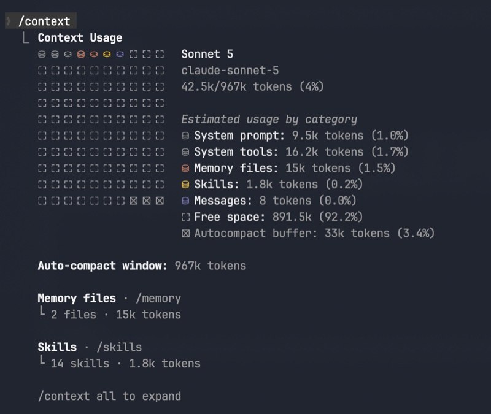
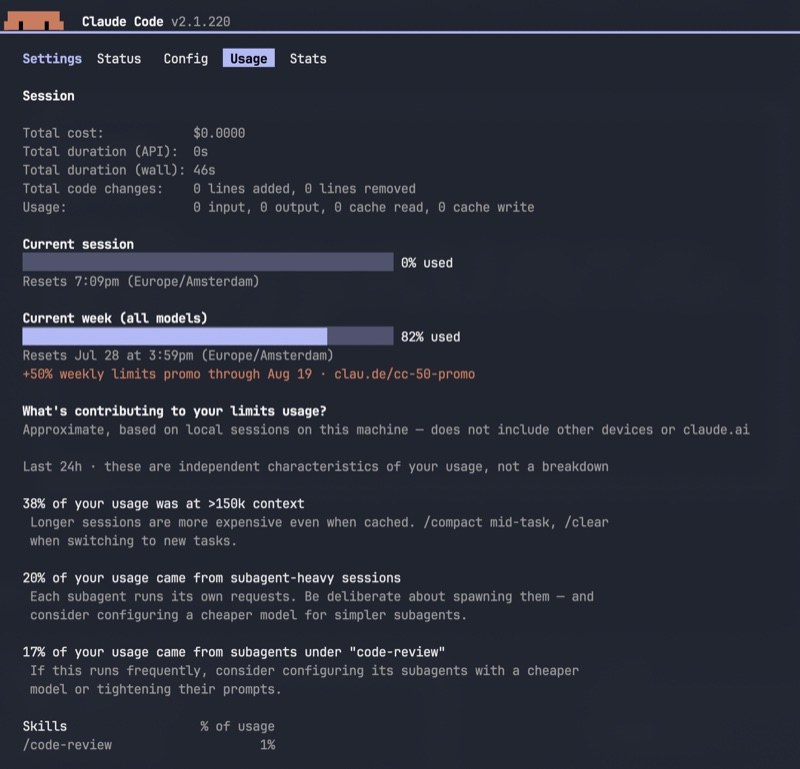
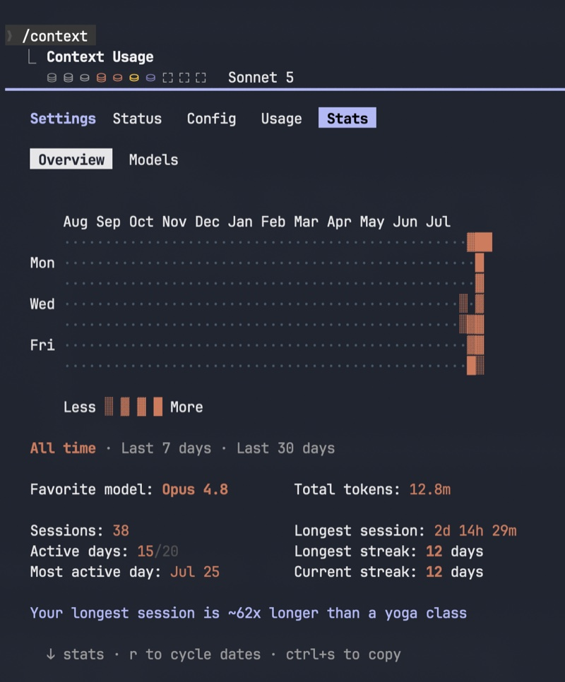
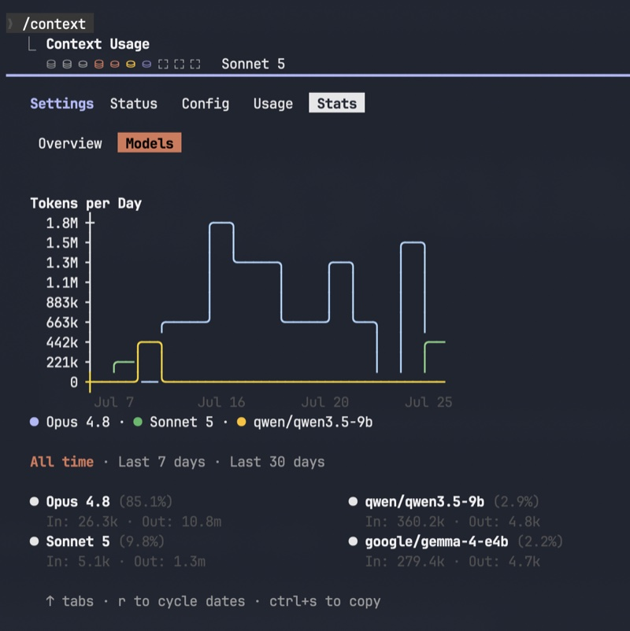
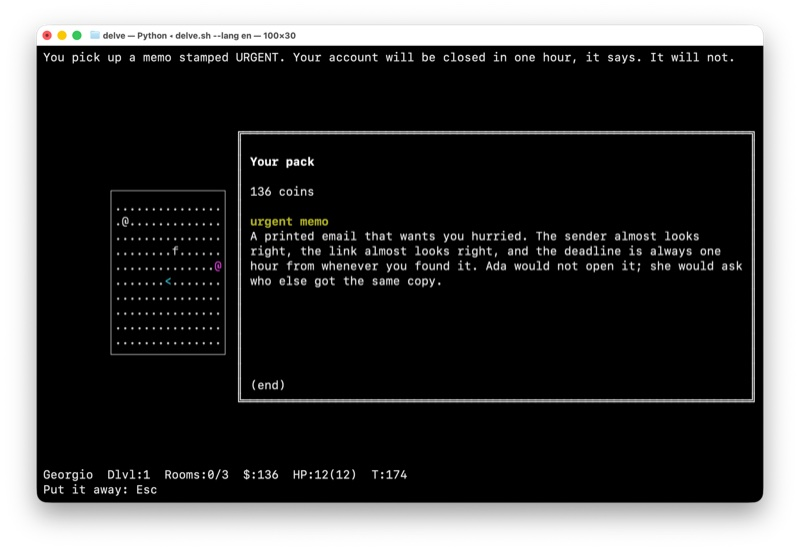

# Grow the pack key (i) into a tabbed information screen

## Summary

`i` opens a plain "Your pack" list today: coins, then each carriable and its `look` text. That is
the only mid-run panel that is about the learner rather than a keeper, and it currently holds only
objects. This epic turns it into a tabbed **information screen** (Pack stays the default tab, so
the key's meaning does not shift), adding tabs for run progress and, once the local grader reports
timings, its health. [docs/INFOSCREEN.md](../docs/INFOSCREEN.md) is the research note this epic
promotes to scheduled work; it lays out the constraints, the chart types that fit a 69-column panel,
and an explicit "do not build" list (no calendar heatmaps, no multi-model token markets, no
full-screen takeover). This issue is the umbrella; it ships no code of its own; it exists so that
future slices (tab strip, coloured borders, progress bars, room pass map, grader metrics) have a
parent to point `epic:` at, per [docs/INFOSCREEN.md](../docs/INFOSCREEN.md) §12's own instruction:
"one `DELVE-NNNN` epic, stories per slice."

## Motivation / problem

Progress currently lives only on the status line (`Rooms:0/3`, `HP:12(12)`, `$:136`, `T:174`) and
the local LLM grader, when configured, is otherwise invisible mid-run (only `delve doctor` shows its
state). A learner who wants to know "how am I doing across this dungeon" or "is the grader actually
alive right now" has nowhere to look while playing. `i` is the natural home: it is already the
"about me" key, it already suspends map input while open, and it already sits beside the room rather
than over it.

## UI inspiration (reference screenshots)

Claude Code's own status surfaces (`/context`, the Settings `Usage` and `Stats` tabs) are the
pattern library cited throughout [docs/INFOSCREEN.md](../docs/INFOSCREEN.md) §2: tabs, a heatmap,
step/line charts, coloured selection chrome. None of these are to be cloned outright (the doc is
explicit that a calendar heatmap and a multi-model token market are the wrong product for a single
dungeon run); they are here as reference for *how much a terminal panel can carry* before it stops
being a list.



*`/context`'s category breakdown. The per-category meter row (system prompt, tools, memory,
skills, messages, free space) is the kind of density §6.1's horizontal-bar sketch (score per
chapter, HP remaining) is reaching for.*



*The `Usage` tab's plain progress bars ("Current session", "Current week") and its
"what's contributing" breakdown are a template for a Scoring > Now sub-tab: a handful of bars
plus one or two plain-English observations, not a wall of numbers.*



*The `Stats` contribution heatmap. Cited in the doc as the "do not build" pattern (§2, §6.4D): a
year-of-commits calendar has no analogue inside one dungeon run. Included here for completeness,
not as a target; the distribution map worth wanting in Delve is rooms-by-chapter (§6.4A), not
days-by-year.*



*This is the one to build toward. The step/line chart ("Tokens per Day") with its SI-suffixed
Y-axis (`1.8M`, `1.5M`, …), sparse X labels (`Jul 7`, `Jul 16`, …), and a coloured per-series
legend below the plot is the shape [docs/INFOSCREEN.md](../docs/INFOSCREEN.md) §6.3 sketches for
Grader > Run: prompt vs. completion tokens (or LLM vs. keyword-fallback share) across sittings, on
the same "two series max, SI Y-axis, sitting index not calendar date" budget. Of everything shown
here, this line/step chart is the pattern most worth carrying into Delve's own Grader tab.*



*What `i` renders today, for contrast: a title, a coin count, an item name and its `look` body,
`(end)`. This is the whole surface this epic grows a tab strip on top of; Pack must keep doing
exactly this when it is the active tab.*

## Proposed screens (generated mock-ups)

These are **generated and asserted, not hand-drawn**, the same discipline as `docs/SCREENS.md`: `./tools.sh infoscreen_mockups` (add `--check` for geometry assertions only) reuses the drawing primitives from `tools/screens.py` and emits each frame onto a real 100x30 grid, asserting the panel's 69-column inner width the same way the built screens already do. They are kept out of `all_screens()`/`SCREENS.md` on purpose: that file is evidence of what is *built*, and none of this exists yet. Change a screen in `tools/infoscreen_mockups.py` and re-paste here; never hand-edit the frames below.

```bash
./tools.sh infoscreen_mockups            # print every mock-up
./tools.sh infoscreen_mockups --check    # assert the geometry, print nothing
```

### A. Pack (default tab)

The tab strip wraps the same content `i` shows today (§ UI inspiration above), so the key's meaning does not shift for anyone who only checks coins.

```
You look through your pack.


                                      ┌───────────────────────┐
    ┌────────────────────┐ ╔═══════════════════════════════════════════════════════════════════════╗
    │....................│ ║ [ Pack ]  Scoring  Grader                                             ║
    │..<.................│ ║                                                                       ║
    │....................│ ║ 70 coins                                                              ║
    │.................@.@+#║                                                                       ║
    │....................│ ║                                                                       ║
    │....................│ ║                                                                       ║
    │....................│ ║ (end)                                                                 ║
    └────────────────────┘ ║                                                                       ║
                           ╚═══════════════════════════════════════════════════════════════════════╝


George the Novice   Dlvl:1  Rooms:2/3  $:70  HP:12(12)  T:118
Tabs: Tab/Shift-Tab   Sub: [ ]   Put away: Esc
```

### B. Scoring > Now

Horizontal bars for score per chapter plus HP ([docs/INFOSCREEN.md](../docs/INFOSCREEN.md) §6.1), built from numbers the status line already shows.

```
You check your progress.


                           ╔═══════════════════════════════════════════════════════════════════════╗
    ┌────────────────────┐ ║ Pack  [ Scoring ]  Grader                                             ║
    │....................│ ║        [ Now ]  Rooms  History                                        ║
    │..<.................│ ║                                                                       ║
    │....................│ ║                                                                       ║
    │.................@.@+#║  Chapters                                                             ║
    │....................│ ║  1 Sorting office   ####################········  92%                 ║
    │....................│ ║  2 The archive      ##############··············  71%                 ║
    │....................│ ║  3 The vault        ····························   n/a                ║
    └────────────────────┘ ║  HP                 ############········  12/12                       ║
                           ║ (end)                                                                 ║
                           ║                                                                       ║
                           ╚═══════════════════════════════════════════════════════════════════════╝


George the Novice   Dlvl:1  Rooms:2/3  $:70  HP:12(12)  T:118
Tabs: Tab/Shift-Tab   Sub: [ ]   Put away: Esc
```

### C. Scoring > Rooms

The room pass map ([docs/INFOSCREEN.md](../docs/INFOSCREEN.md) §6.4A): one cell per room, grouped by chapter, filled by pass score, never the calendar-heatmap shape the doc's non-goals rule out.

```
You check your progress.


                           ╔═══════════════════════════════════════════════════════════════════════╗
    ┌────────────────────┐ ║ Pack  [ Scoring ]  Grader                                             ║
    │....................│ ║        Now  [ Rooms ]  History                                        ║
    │..<.................│ ║                                                                       ║
    │....................│ ║                                                                       ║
    │.................@.@+#║  Pass map                         less ░ ▒ ▓ █ more                   ║
    │....................│ ║  Dlvl 1  ░░██▒▒██░░░░                                                 ║
    │....................│ ║  Dlvl 2  ░░▒▒░░░░····                                                 ║
    │....................│ ║  Dlvl 3  ············   · sealed   ░ sat  ▒ ok  █ clear               ║
    └────────────────────┘ ║ (end)                                                                 ║
                           ║                                                                       ║
                           ╚═══════════════════════════════════════════════════════════════════════╝


George the Novice   Dlvl:1  Rooms:2/3  $:70  HP:12(12)  T:118
Tabs: Tab/Shift-Tab   Sub: [ ]   Put away: Esc
```

### D. Grader > Live

Local grader status ([docs/INFOSCREEN.md](../docs/INFOSCREEN.md) §7): model, warm/cold, this run's token and fallback counts, and a latency sparkline across sittings. Depends on `assess/llm.py:OllamaClient.chat` stopping discarding Ollama's timing/token fields first.

```
You check the grader.


                           ╔═══════════════════════════════════════════════════════════════════════╗
                           ║ Pack  Scoring  [ Grader ]                                             ║
    ┌────────────────────┐ ║                  [ Live ]  Run                                        ║
    │....................│ ║                                                                       ║
    │..<.................│ ║                                                                       ║
    │....................│ ║   Model     qwen2.5:3b @ localhost:11434                              ║
    │.................@.@+#║   Status    warm . last grade 520 ms                                  ║
    │....................│ ║   This run  In 2.1k   Out 480   LLM 7   keyword 1                     ║
    │....................│ ║                                                                       ║
    │....................│ ║   Latency   ▁▁▂▃▂▁▄█▂▁  (sittings)                                    ║
    └────────────────────┘ ║                                                                       ║
                           ║   Below 0.65 confidence falls to keywords; that is normal.            ║
                           ║ (end)                                                                 ║
                           ║                                                                       ║
                           ╚═══════════════════════════════════════════════════════════════════════╝


George the Novice   Dlvl:1  Rooms:2/3  $:70  HP:12(12)  T:118
Tabs: Tab/Shift-Tab   Sub: [ ]   Put away: Esc
```

## Child stories

An epic carries no code of its own; it is done when its children are (AGILE.md). None are filed
yet; per [docs/INFOSCREEN.md](../docs/INFOSCREEN.md) §9's priority table, they should be cut in
this order:

- **[[DELVE-0040]]** - *Tabbed `InfoView` with Pack as the default tab.* The foundation: `i` grows a
  primary tab strip (`Pack` / `Scoring` / `Grader`), Pack keeps its current job and content, and
  the view model moves from a plain `TextView` to an `InfoView(tab, subtab, …)` the pager and tab
  strip both understand. Every other child depends on this one landing first.
- **[[DELVE-0041]]** - *Info panel tabs, take 2: a coloured pill, arrow-key navigation, and a panel
  title.* Playtesting DELVE-0040 split this row's original scope in two: the tab-pill half (filled
  selection pills via the existing `bar_attr` pattern, BUTTONS.md, replacing the `[ Pack ]` bracket
  convention), plus two more small tab-strip findings (left/right arrows alongside Tab/Shift-Tab,
  and a fixed `Info` panel title before the tabs). Tinting the double-line frame by active primary
  tab (`docs/INFOSCREEN.md` §8) did **not** move with it and is still unfiled, future work.
- **[[DELVE-0042]]** - *Scoring tab, take 1: horizontal bars for chapter score and HP.*
  Horizontal-bar chart (§6.1) built from numbers the status line already shows: one row per scored
  chapter (`n/a` before any gate in it is passed, never a misleading `0%`) plus an HP row. Ships
  the whole Scoring body directly, no sub-tab row yet.
- **[[DELVE-0043]]** - *Scoring tab, take 2: coloured bars, a rename from Progress, and a stale hint
  fix.* Bars draw as coloured `█`/`░` blocks instead of `#`/`·` ASCII; the tab (and everywhere it
  is named) is renamed "Scoring" since it shows score, not completion; and the walking hint's
  stale `Inventory: i` (left over from before DELVE-0040) becomes `Info: i`.
- **[[DELVE-0044]]** - *A fourth primary tab, `Status`.* App/run diagnostics (version, pack + locale,
  terminal size, grader model/host), on the model of Claude Code's own `Status` tab; no live
  grader health yet (that stays the separate `Grader` tab's own future story).
- **[[DELVE-0053]]** - *Stop discarding Ollama's timing and token fields on every grader chat
  call.* The §7 prerequisite: `OllamaClient.chat` returns a `ChatReply(text, metrics)` instead of a
  bare string, and `LLMGrader` accumulates a run-scoped `GraderMetrics` (tokens, latency, warm/cold,
  LLM-vs-keyword-fallback counts) across calls. Plumbing only, no UI.
- **[[DELVE-0054]]** - *Grader tab, take 1: model/status/token rows from `GraderMetrics`.* Fills the
  Grader tab's `item.tab_soon` placeholder with the `Model`/`Status`/`This run` rows §7's `Live`
  mock-up sketches, read from DELVE-0053's accumulator; the offline (no model configured) case
  renders as one explanatory line. No sub-tab split and no latency sparkline yet.
- **[[DELVE-0055]]** - *Scoring tab grows a Now/Rooms sub-tab strip; Rooms shows the room pass
  map.* The distribution-map sketch in §6.4A; one glyph per room, grouped by chapter, filled by
  whether it has been attempted, passed, or passed cleanly. Honest Delve data (`Gate.passed` /
  `.sittings` / `.attempts_used`), and the generic `InfoView` sub-tab mechanism (`[`/`]`) a later
  Grader Live/Run split can reuse.
- *Grader > Live / Run split, and a latency sparkline (future, no id yet).* Now that DELVE-0053
  keeps the metrics and DELVE-0054 surfaces the plain rows, a `Live`/`Run` sub-tab split and a
  latency sparkline across sittings still need `GraderMetrics` to grow a per-sitting history (it
  currently keeps only last/max), which is its own future story.

## Non-goals

- No calendar/contribution heatmap of days played (§2, §6.4D); the room pass map is the
  distribution visual Delve actually wants.
- No multi-model token market; one local grader model per run (`--grader-model`), not a fleet.
- No full-screen takeover. The map must stay visible; the panel keeps its ~69-column inner width
  budget (`windows.PANEL_W` / `TEXT_W`).
- No new gate mechanic. Objects and progress charts show *what happened*; they must not become a
  second gate (`OBJECTS.md` §2, rule 2: sealed doors are structural).
- No change to how the local LLM grader is invoked or its confidence floor; this epic only surfaces
  numbers the grader stack already produces (or, for §7, numbers Ollama already returns and the
  client currently discards).

## Design notes / links

[docs/INFOSCREEN.md](../docs/INFOSCREEN.md) is the full design note (11 sections plus hand
sketches) and is not re-derived here. The load-bearing constraints for every child story, restated
from its §3: `ui` only paints (rule 2, `session.apply(Command) -> Frame`; a chart is presentation
of numbers the session or progress store already computed, never a new import into `ui`); sixteen
colours only (`ui/attrs.py`); the double-line frame stays the mode boundary and must never be
confused with `ACS_` room walls; every new label goes through `Strings` (`en.toml` / `nl.toml`);
passing stays final, so any room-score chart is write-once history, not a grind meter (rule 3).

## Acceptance / verification

This epic is done when every child story above is filed with its own `DELVE-NNNN` id (pointing
`epic:` back at this one), implemented, archived with its own commits, and `./run-tests.sh` is
green. It ships no code of its own; track completion by the child list.
