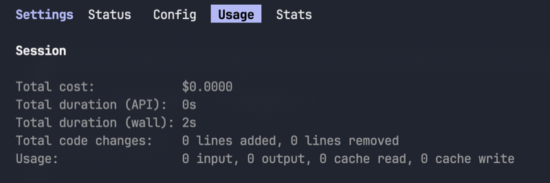

# Info panel tabs, take 2, a coloured pill, arrow-key navigation, and a panel title

## Summary

Three playtesting findings on DELVE-0040 (the `i` panel's tab strip), all folded into one story since they touch the same few lines of `_draw_info`. First: on a colour terminal, the active tab should render as a filled pill (black text on a solid colour), the same `bar_attr` treatment Claude Code's own tab chrome uses (a reference screenshot is attached, `assets/DELVE-0041-claude-code-tabs.png`) and the same one Delve already uses for a focused MCQ option's number badge, replacing the shipped `[ Pack ]`-style bracket marker. Second: the left/right arrow keys should cycle tabs too, alongside the shipped `Tab`/`Shift-Tab`, matching the horizontal-arrows convention `PromptView`'s two-button focus already uses and the sketch in INFOSCREEN.md §5's key table. Third: the tab strip should be preceded by a fixed panel title, `Info`, so the row reads as "Info: Pack, Progress, Grader" rather than three bare words with no name for the screen they belong to (the reference screenshot's own tab row is read the same way, a named surface with these as its sections). This is the first slice of DELVE-0035's child 2 ("Coloured borders + tab pills", INFOSCREEN.md §8/§9 row 2), scoped to just the tab strip; border tinting by active tab is left for a later story.

*The reference for the pill treatment: only the active tab gets a solid fill; the rest stay plain text. Delve's own version reuses `attrs.bar_attr`, already proven on the MCQ focus badge, rather than inventing a new colour pairing.*

## Motivation / problem

`[ Pack ]  Progress  Grader` (the bracket convention `_draw_info` ships today) reads as plain text; a filled pill is a stronger, more immediate "you are here" signal and matches the `bar_attr` pattern Delve already relies on for the MCQ focus badge and the correct/not-quite message bar, so it costs no new colour-handling code, only a new call site. `ui/attrs.py:bar_attr` already degrades to `curses.A_REVERSE` on a terminal with no colour support, so "when there is colour support" is not a new capability to detect, just the existing fallback this function already provides. Separately, `Tab`/`Shift-Tab` alone is a smaller key surface than the rest of Delve's horizontal-choice UI already offers: `PromptView`'s assertion buttons already move focus with the left/right arrows, so a learner who has played any assertion question has already learned "arrows move sideways along a row of choices" and currently cannot apply that muscle memory to the tab strip. Third, DELVE-0040 shipped the tab strip with no name for the panel itself; unlike the lesson panel (which titles itself from the keeper's own heading), the info panel's three tabs currently float with nothing telling the learner what screen they are looking at.

## Stories

### As a learner playing on a colour terminal, I want the active info-panel tab to stand out as a filled pill, so that the current tab reads at a glance the way it does in other tabbed tools.

- Given the info panel is open on a terminal with colour support, when it renders, then the active tab's label is drawn with `attrs.bar_attr` (black text on a solid colour), not wrapped in `[ ]` brackets, and the inactive tabs render in the plain attribute as today.
- Given the info panel is open on a terminal with **no** colour support, when it renders, then the active tab falls back to `curses.A_REVERSE` (`bar_attr`'s own existing fallback), so the active tab is still visually distinct without inventing a second code path.
- Given the active tab changes (`Tab`/`Shift-Tab`), when the panel redraws, then the pill moves to the newly active tab and the previously active tab returns to plain text.

### As a maintainer, I want the pill colour to be a fixed, documented choice, so that a later child story (per-tab border tinting) can reuse the same colour without re-deriving it.

- Given the tab strip renders, then every tab (Pack, Progress, and Grader alike) uses the **same** pill colour for its own active state in this story; INFOSCREEN.md §8's per-tab colour table (`BRIGHT_YELLOW`/`BRIGHT_CYAN`/`BRIGHT_MAGENTA`) is for the *border*, a separate later story, and this one does not need to anticipate it. Pick one existing bright colour already used for selection chrome (`BRIGHT_CYAN`, the same one `_draw_menu`'s focus badge uses) so the pill reads as "focus", consistent with the rest of the panel's chrome.

### As a learner, I want the left/right arrow keys to cycle info-panel tabs, so that I can use the same keys I already use on an assertion's two buttons.

- Given the info panel is open, when the learner presses the right arrow, then the active tab advances exactly as `Tab` does (wrapping Pack -> Progress -> Grader -> Pack); the left arrow cycles the other direction exactly as `Shift-Tab` does.
- Given the hint line while the info panel is open, when it renders, then it names both key options for tab-cycling (e.g. `Tabs: ←→/Tab` alongside the existing close chord), so a learner is not left to guess that arrows also work.
- Given the arrow keys are now bound inside the info panel, when any other overlay (a menu, a prompt, an amount field) is open, then their existing arrow bindings are unaffected; this story only touches `panel_command`'s `InfoView` branch.

### As a learner, I want the info panel to show a panel title before its tabs, so that I know what screen the tab strip belongs to.

- Given the info panel opens, when it renders, then the tab-strip row reads `Info` (localised) followed by the tab strip, on the model of the reference screenshot's own named surface; `Info` is a fixed label, never itself a selectable or active tab.
- Given the panel title is added, when the row is measured against the 69-column inner width (`windows.TEXT_W`), then it still fits at the tab strip's widest state (all three tabs, one active as a pill) without truncation or wrapping onto a second line.
- Given both locales, when the panel opens under `--lang nl`, then the title renders through `Strings` the same as every other new label in this story (no hard-coded English word reaching `ui`).

## Non-goals

- No border tinting by active tab (INFOSCREEN.md §8); that stays DELVE-0035's own later child story, since it is a separate design call (a colour per tab, not one focus colour) with its own row in the epic's priority table.
- No change to Pack/Progress/Grader's *content*; this is a pure rendering and key-handling change to the tab-strip row and `panel_command`'s `InfoView` branch.
- No new capability detection; `attrs.bar_attr`'s existing colour-support check and fallback are reused as-is.
- No sub-tab row yet; `Info` names the whole panel, not a primary-tab-specific heading, and stays fixed across all three tabs.
- No renumbering or renaming of the existing tabs (`Pack`/`Progress`/`Grader`); this story only adds the title in front of them.

## Design notes / links

- `ui/attrs.py:bar_attr` (already used by `windows._draw_menu`'s focused-option badge) is the exact primitive this story calls from `windows._draw_info`; no change to `attrs.py` itself is expected.
- [docs/INFOSCREEN.md](../docs/INFOSCREEN.md) §8 ("Coloured borders") and §9 (row 2, "Coloured borders + tab pills") is the design note this story partially promotes; update its status note once this ships, the same way DELVE-0040 left a mark on §1/§4/§5.
- The arrow-key binding lives in `ui/keys.py:panel_command`'s existing `isinstance(overlay, InfoView)` branch (added by DELVE-0040), alongside the `ord("\t")`/`curses.KEY_BTAB` cases already there; `curses.KEY_LEFT`/`curses.KEY_RIGHT` map to the same `TabCycle` command, no new Command type needed.
- The panel title is a new `Strings` key (e.g. `item.info_title`), filled onto `InfoView` the same way `title` reaches a `TextView` today (session builds it, `ui` only paints it, rule 2); both locales get it in the same commit.
- `docs/SCREENS.md`'s pack screen (regenerated by DELVE-0040) **is** re-regenerated by this story, since the title row is plain text and shows in the ASCII mock-up unlike the pill colour (which `tools/screens.py` cannot represent, having no curses colour attributes); the pill and the extra key binding have no visual/textual trace in that mock-up and are verified by the render test and manual check below instead.

## Acceptance / verification

- A `tests/test_render.py` case renders an `InfoView` and asserts: the active tab is drawn without `[ ]` brackets around its label (the plain label text appears; the bracket form does not), and the row includes the `Info` title before the tab labels.
- A headless test (`tests/test_items.py` or similar) asserts `curses.KEY_LEFT`/`curses.KEY_RIGHT` produce the same `TabCycle` commands as `Tab`/`Shift-Tab` via `keys.panel_command`.
- `tests/test_languages.py` confirms the new `Info` title string exists and renders in both `en` and `nl`.
- `./tools.sh screens --check` passes after `docs/SCREENS.md`'s pack screen is regenerated to include the `Info` title.
- A unit test on `attrs.bar_attr` (or reuse of the existing one) is not duplicated; this story only adds the `windows._draw_info` call site.
- Manual verification: run `./delve.sh`, open `i` on a colour terminal, confirm the active tab shows as a filled pill and both Tab/Shift-Tab and the arrow keys move it; note in the PR/commit that this was eyeballed, since `CursesEmu` cannot assert on curses colour pairs.
- `./run-tests.sh` is green.
